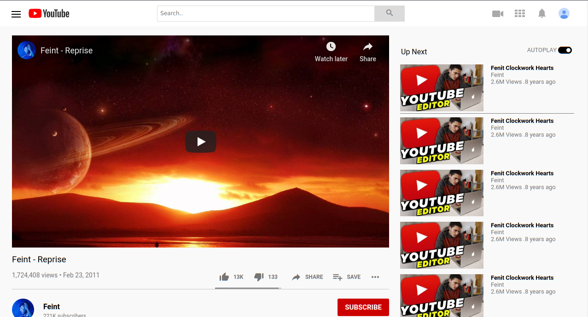

# Youtube's Video Page Clone

This is just a clone of youtube's video page

## Built With

- HTML and CSS

## Live Demo

[Live Demo Link](https://mimipeshy.github.io/embedding-videos-html)

## Getting Started

To get a local copy up and running follow these simple example steps.

### Usage
- Just open the `index.html` file

## Authors

👤 **WinterCore**

- Github: [@githubhandle](https://github.com/WinterCore)

👤 **Mimipeshy**

- Github: [@githubhandle](https://github.com/mimipeshy)

## 🤝 Contributing

Contributions, issues and feature requests are welcome!

Feel free to check the [issues page](issues/).

## Show your support

Give a ⭐️ if you like this project!

## Acknowledgments

- Hat tip to anyone whose code was used
- Inspiration
- etc

## 📝 License

This project is [MIT](lic.url) licensed.
